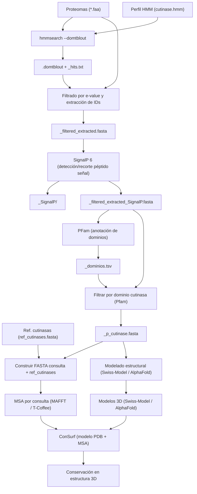

# Pipeline para identificación, filtrado y análisis de cutinasas

Resumen
-------
Este repositorio contiene la descripción de un pipeline bioinformático para identificar secuencias candidatas a cutinasas a partir de archivos FASTA de proteínas (.faa) y un perfil HMM (.hmm); filtrar por e‑valor; eliminar péptidos señal con SignalP 6; anotar dominios con PFam; seleccionar secuencias con dominio de cutinasa y preparar MSAs por consulta junto con secuencias de referencia, para su uso posterior en ConSurf y en el modelado de estructuras.  
Este documento explica requisitos, convenciones de nombres, pasos, ejemplos de comandos y recomendaciones de despliegue.



Pregunta de investigación, hipótesis y objetivo
-----------------------------------------------

**Pregunta de investigación**
¿Puede un flujo automatizado combinar HMMER, PFam y análisis de conservación estructural para distinguir entre verdaderas cutinasas funcionales y proteínas cutinasa-like en proteomas diversos?

**Hipótesis**
La integración de detección por HMMER, anotación de dominios con InterProScan y análisis de conservación estructural permitirá diferenciar de manera confiable las cutinasas funcionales de las proteínas cutinasa-like, al combinar evidencia de similitud de secuencia, arquitectura de dominios y conservación de residuos catalíticos.

**Objetivo**
Desarrollar y evaluar un pipeline automatizado que integre HMMER, PFam y análisis de conservación estructural para discriminar entre cutinasas funcionales y proteínas cutinasa-like en proteomas diversos.

Tabla de contenidos
------------------
- Descripción general
- Requisitos y dependencias
- Directorio
- Flujo de trabajo y ejemplos de comandos
- Formatos de salida

Descripción general
------------------
Lenguaje:
- Bash
- Python
Entrada principal:
- Uno o varios archivos FASTA de proteínas con extensión .faa
- Un perfil HMM (.hmm) que define la familia o dominio a buscar
Entrada adicional:
- `ref_cutinases.fasta` (secuencias de referencia)
  
Salida esperada (por archivo .faa de entrada):
- `<sample>_hits.txt` — tabla con resultados del HMMER
- `<sample>_filtered_extracted.fasta` — secuencias del .faa cuyo e‑value es menor que el umbral dado
- Directorio `<sample>_SignalP/` — resultados de SignalP 6
- `<sample>_filtered_extracted_SignalP.fasta` — secuencias recortadas tras remover péptido señal, si procede
- `<sample>_interpro.tsv` — salida tabular de InterProScan con dominios/familias
- `<sample>_p_cutinase.fasta` — archivo final con secuencias que contienen dominio de cutinasa

Requisitos y dependencias
------------------------
Herramientas principales:
- HMMER (hmmsearch)
- seqtk o samtools faidx / biopython (extracción/manipulación FASTA)
- SignalP 6 (identificación de péptido señal)
- PFam (identificación de dominios de cutinasas)
- MAFFT (para alineamientos múltiples)
- awk / sed / grep / python (para parsing)

Directorio
----------
```text
<estructura>
cutinasas_pipeline/

├── data/
│   ├── proteomes/
│   │   ├── fus_oxy.faa
│   │   └── *.faa / *.fasta
│   │
│   ├── hmm_model/
│   │   └── cutinase.hmm
│   │
│   └── references/
│       └── ref_cutinases.fasta
│
├── databases/
│   ├── pfam/
│   │   ├── Pfam-A.hmm
│   │   ├── Pfam-A.hmm.h3f
│   │   ├── Pfam-A.hmm.h3i
│   │   ├── Pfam-A.hmm.h3m
│   │   └── Pfam-A.hmm.h3p
│   └── (otras DBs si aplica)
│
├── scripts/
│   ├── 01_hmmsearch/
│   │   ├── 01_run_hmmsearch.sh
│   │   └── 02_filter_extract_fasta.sh
│   │
│   ├── 02_signalp/
│   │   └── 01_run_signalp_cleave.sh
│   │
│   ├── 03_pfam/
│   │   └── 01_run_pfam_select_cutinase.sh
│   │
│   ├── 04_msa/
│   │   └── 01_make_msas_per_hit.sh
│   │
│   ├── 05_summary/
│   │   └── build_summary_csv.py
│   │
│   └── run_pipeline_master.sh
│
├── results/
│   ├── 01_hmmsearch/
│   │   └── <sample>/
│   │       ├── <sample>.domtblout *
│   │       ├── <sample>_hmmsearch.out
│   │       ├── <sample>_hits.tsv
│   │       ├── <sample>_ids_evalue.txt
│   │       └── <sample>_hits_filtered.fasta *
│   │
│   ├── 02_signalp/
│   │   └── <sample>/
│   │       ├── <sample>_signalp_out/
│   │       │   └── output.gff3
│   │       ├── <sample>_signalP_summary.tsv *
│   │       ├── <sample>_signalp_trimmed.fasta *
│   │       └── <sample>_signalp_noSP.fasta
│   │
│   ├── 03_pfam/
│   │   └── <sample>/
│   │       ├── <sample>_pfam.domtblout *
│   │       ├── <sample>_pfam.hmmscan.out
│   │       ├── <sample>_pfam_cutinase_ids.txt
│   │       └── <sample>_pfam_filtered.fasta *
│   │
│   ├── 04_msa/
│   │   └── <sample>/
│   │       ├── <sample>_query_plus_refs/
│   │       │   └── <hit>.fasta
│   │       └── <sample>_alignments/ *
│   │           └── <hit>_aln.fas
│   │
│   └── summary/
│       └── cutinase_candidates_summary.csv
│
└── environments/
    ├── cutinase_pipe.yml
    └── signalp6.yml

```

Flujo de trabajo y ejemplos de comandos
--------------------------------------------------

1) Búsqueda HMM — generar `<sample>_hits.txt`
- Comando ejemplo (por cada archivo .faa):
  - hmmsearch --domtblout sample.domtblout profile.hmm sample.faa > sample.hmmsearch.out
  - NOTA: use `--domtblout` para hits por dominio o `--tblout` para hits por secuencia.
- Extraer tabla legible (ejemplo genérico):
  - awk '!/^#/ { print $1"\t"$4"\t"$7"\t"$13 }' sample.domtblout > sample_hits.txt
  - (Ajuste columnas según formato de `domtblout`; revisar encabezados de HMMER)

2) Filtrado por e‑value y extracción de secuencias — generar `_filtered_extracted.fasta`
- Umbral de e‑value: puede introducirse en notación científica "1.10E-55".
- Ejemplo (usando awk + seqtk):
  - awk -v thr=1.10E-55 '$0 !~ /^#/ && $0 != "" { if ($13+0 < thr) print $1 }' sample.domtblout > ids_to_extract.txt
    - (aquí $13 es un ejemplo; ajustar columna del e‑value según `domtblout`)
  - seqtk subseq sample.faa ids_to_extract.txt > sample_filtered_extracted.fasta

3) SignalP 6 — detectar y recortar péptidos señal
- Con SignalP 6 instalado ejecutar:
  - signalp6 -fasta sample_filtered_extracted.fasta -org gram- -format short -gff3 -outfile sample_signalp.out
  - Parsear la salida para obtener posiciones de corte (cleavage site) y recortar secuencias:
- Guardar resultados de SignalP en directorio: `mkdir -p sample_SignalP && mv sample_signalp.* sample_SignalP/`

4) InterProScan — anotación de dominios/familias
- Ejecutar InterProScan (local):
  - interproscan.sh -i sample_filtered_extracted_SignalP.fasta -f tsv -o sample_interpro.tsv -dp
- NOTA: InterProScan necesita bases de datos grandes y mucho tiempo; si no dispone de recursos, use la API del EBI con límites o ejecute en servidor/HPC.

5) Filtrado por dominio "cutinase" — generar `_p_cutinase.fasta`
- Identificar ID(s) asociados a cutinasa (por ejemplo Pfam o InterPro accesions). Debe confirmar el identificador exacto (ej.: PF01083, IPR##### — buscar en InterPro).
- Extraer IDs con ese dominio desde `sample_interpro.tsv`:
  - awk -F'\t' '$1 != "" && ($x ~ /CUTINASE_IDENTIFIER|cutinase/i) { print $1 }' sample_interpro.tsv | sort -u > ids_cutinase.txt
    - (reemplazar condición con el acceso/ID correcto)
  - seqtk subseq sample_filtered_extracted_SignalP.fasta ids_cutinase.txt > sample_p_cutinase.fasta

MSAs por consulta
---------------------------
- Para cada consulta en `sample_p_cutinase.fasta`:
  - Crear un FASTA que contenga la consulta + todas las ref_cutinases:
    - for id in $(seqkit seq -n sample_p_cutinase.fasta); do seqkit grep -n -p "^$id\$" sample_p_cutinase.fasta > q.fa; cat ref_cutinases.fasta >> q.fa; mafft --auto q.fa > msa_${id}.fasta; done

Modelado
---------------------------
El modelado se hará en web y no formará parte del pipeline, pero si del workflow

ConSurf
-------
- ConSurf requiere: modelo PDB y un MSA.
- Por cada consulta:
  - Tener `model.pdb` (resultado de Swiss‑Model) y `msa_${id}.fasta`.
  - Subir a ConSurf; ConSurf generará un directorio de resultados por trabajo.

Formato de archivos y convenciones de nombres
--------------------------------------------
- Entradas:
  - `<sample>.faa` — multi-FASTA, headers deben tener IDs únicos (evitar espacios o normalizarlos)
  - `profile.hmm` — HMMER profile
- Salidas (por sample):
  - `<sample>_hits.txt` — tabla tabulada (ID, target, e-value, score, dominio, etc.)
  - `<sample>_filtered_extracted.fasta`
  - `<sample>_SignalP/` — archivos de SignalP
  - `<sample>_filtered_extracted_SignalP.fasta`
  - `<sample>_interpro.tsv`
  - `<sample>_p_cutinase.fasta`

